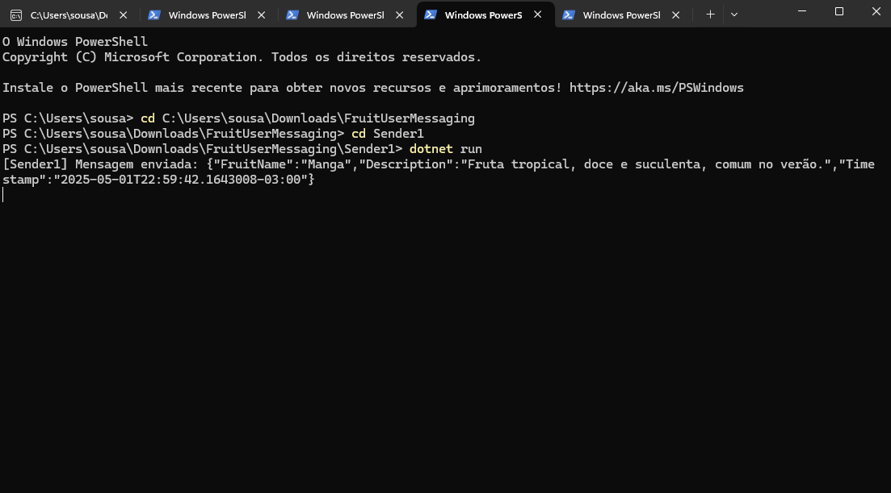
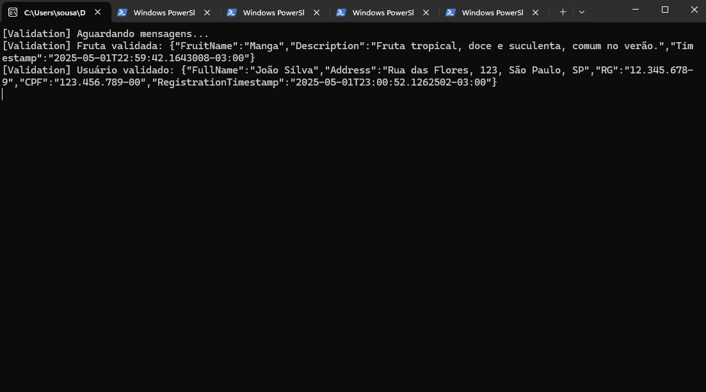
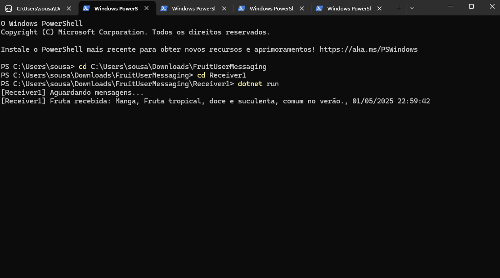
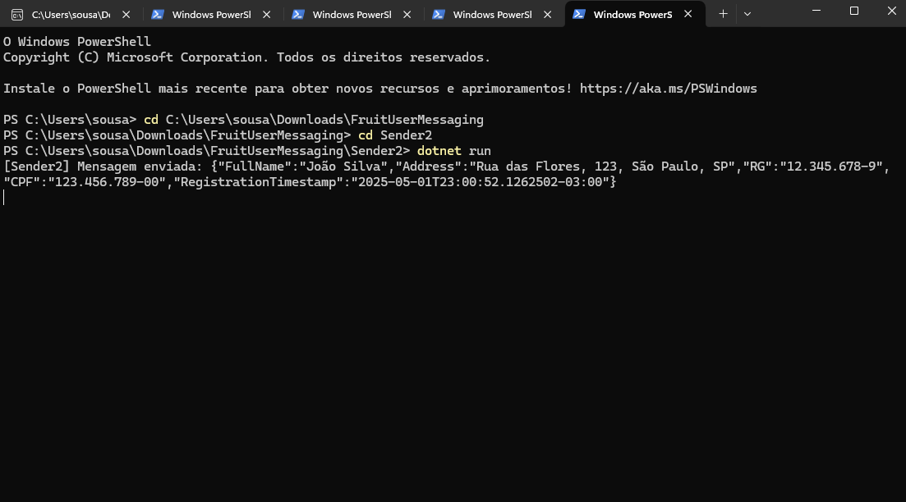
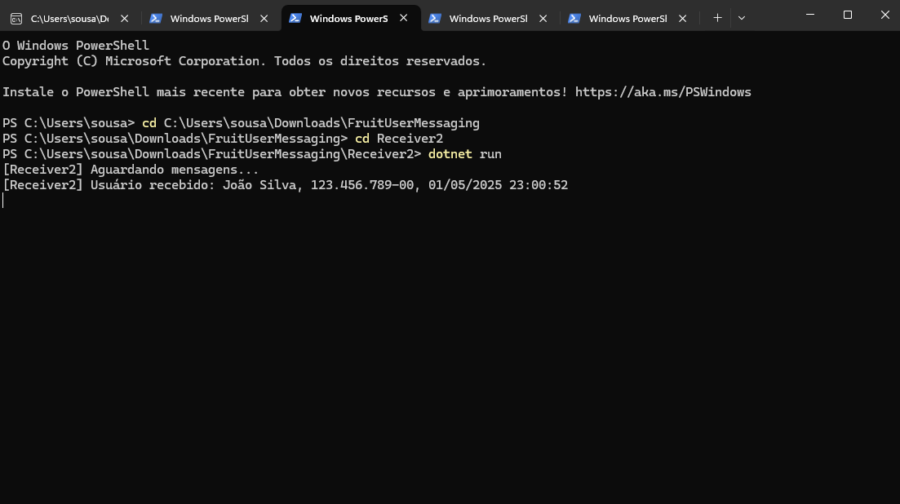
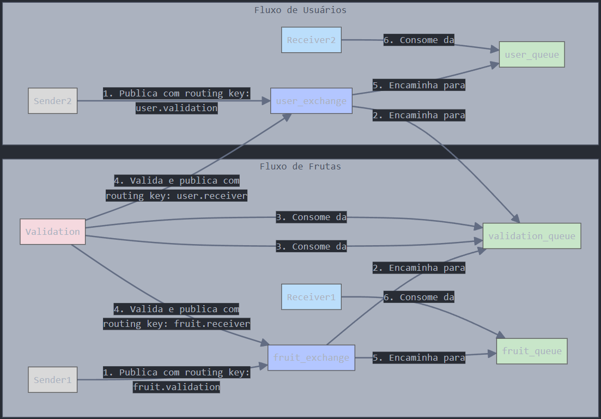

# FruitUserMessaging

Aplicativo de console em C# que implementa um sistema de mensageria usando RabbitMQ para envio e recebimento de mensagens sobre frutas de época e dados de usuário, com validação intermediária.

## Tecnologias Utilizadas

- C# (.NET 8.0)
- Visual Studio 2022
- RabbitMQ (rodando em container Docker)
- Bibliotecas:
  - RabbitMQ.Client (NuGet)
  - Newtonsoft.Json (NuGet)
- Docker Desktop

## Estrutura do Projeto

- **Sender1**: Envia mensagens sobre frutas de época (nome, descrição, data e horário).
- **Sender2**: Envia mensagens sobre dados de usuário (nome completo, endereço, RG, CPF, data de registro).
- **Validation**: Valida mensagens de frutas e usuários antes de encaminhá-las.
- **Receiver1**: Recebe mensagens validadas sobre frutas.
- **Receiver2**: Recebe mensagens validadas sobre usuários.
- **Model**: Contém as classes FruitMessage e UserMessage para modelagem dos dados.
- **Common**: Gerencia a conexão com o RabbitMQ.

## Definições

### Exchanges (tipo direct):
- `fruit_exchange`: Para mensagens de frutas.
- `user_exchange`: Para mensagens de usuários.

### Filas:
- `validation_queue`: Recebe mensagens para validação (de Sender1 e Sender2).
- `fruit_queue`: Recebe mensagens validadas de frutas (Receiver1).
- `user_queue`: Recebe mensagens validadas de usuários (Receiver2).

### Routing Keys:
- `fruit.validation`: Sender1 → Validation.
- `fruit.receiver`: Validation → Receiver1.
- `user.validation`: Sender2 → Validation.
- `user.receiver`: Validation → Receiver2.

## Pré-requisitos

- Docker Desktop instalado: [Download Docker Desktop](https://www.docker.com/products/docker-desktop).
- Visual Studio 2022 com suporte a .NET 8.0.
- NuGet Packages:
  - RabbitMQ.Client
  - Newtonsoft.Json

## Configuração do Ambiente e Exemplos de Testagem

### Verificar e Iniciar o Container
Verifique se o container rabbitmq aparece. Caso não esteja, inicie-o:
```bash
docker start rabbitmq
```

### Criar um Novo Container
Se o container não existir, crie-o:
```bash
docker run -d --name rabbitmq -p 5672:5672 -p 15672:15672 rabbitmq:3-management
```

### Acessar Interface de Gerenciamento
- Abra http://localhost:15672 no navegador
- Faça login com usuário `guest` e senha `guest`
- Verifique as abas Exchanges, Queues, e Connections (serão preenchidas após a execução dos projetos)

### Testar Conectividade
Certifique-se de que as portas 5672 (AMQP) e 15672 (HTTP) estão liberadas:
```bash
netstat -a -n -o | findstr :5672
netstat -a -n -o | findstr :15672
```

Se as portas estiverem em uso, pare os processos conflitantes ou altere as portas no comando Docker.

## 2. Executar os Projetos

Para testar o fluxo de mensagens, execute os projetos na seguinte ordem:

### Iniciar o Validation:
No Visual Studio, clique com o botão direito no projeto Validation > Debug > Start New Instance.

Alternativamente, no terminal:
```bash
cd Validation
dotnet run
```

**Saída Esperada:**
```
[Validation] Aguardando mensagens...
```

### Iniciar os Receivers:
Inicie Receiver1 e Receiver2 (em janelas separadas ou no Visual Studio):
```bash
cd Receiver1
dotnet run
```

```bash
cd Receiver2
dotnet run
```

**Saída Esperada:**  
Receiver1:
```
[Receiver1] Aguardando mensagens...
```

Receiver2:
```
[Receiver2] Aguardando mensagens...
```

### Iniciar os Senders:
Execute Sender1 para testar o fluxo de frutas:
```bash
cd Sender1
dotnet run
```

Execute Sender2 para testar o fluxo de usuários:
```bash
cd Sender2
dotnet run
```

## 3. Verificar o Fluxo de Mensagens

### Teste 1: Par Sender1/Receiver1 (Frutas)

**Executar o Sender1:**
Após iniciar Validation e Receiver1, execute Sender1.

**Saídas Esperadas:**

Sender1:
```
[Sender1] Mensagem enviada: {"FruitName":"Manga","Description":"Fruta tropical, doce e suculenta, comum no verão.","Timestamp":"2025-04-29T10:00:00"}
```
<br>



Validation:
```
[Validation] Fruta validada: {"FruitName":"Manga","Description":"Fruta tropical, doce e suculenta, comum no verão.","Timestamp":"2025-04-29T10:00:00"}
```
<br>



Receiver1:
```
[Receiver1] Fruta recebida: Manga, Fruta tropical, doce e suculenta, comum no verão., 2025-04-29 10:00:00
```
<br>



**Verificar no RabbitMQ:**
- Acesse http://localhost:15672 > Queues
- Clique em `validation_queue` e verifique se mensagens foram consumidas
- Clique em `fruit_queue` e verifique se a mensagem foi entregue
- Em Exchanges > `fruit_exchange`, confira os bindings para `fruit.validation` e `fruit.receiver`

### Teste 2: Par Sender2/Receiver2 (Usuários)

**Executar o Sender2:**
Com Validation e Receiver2 rodando, execute Sender2.

**Saídas Esperadas:**

Sender2:
```
[Sender2] Mensagem enviada: {"FullName":"João Silva","Address":"Rua das Flores, 123, São Paulo, SP","RG":"12.345.678-9","CPF":"123.456.789-00","RegistrationTimestamp":"2025-04-29T10:00:00"}
```
<br>



Validation:
```
[Validation] Usuário validado: {"FullName":"João Silva","Address":"Rua das Flores, 123, São Paulo, SP","RG":"12.345.678-9","CPF":"123.456.789-00","RegistrationTimestamp":"2025-04-29T10:00:00"}
```
<br>


Receiver2:
```
[Receiver2] Usuário recebido: João Silva, 123.456.789-00, 2025-04-29 10:00:00
```
<br>



**Verificar no RabbitMQ:**
- Em Queues, confira `validation_queue` (mensagens consumidas) e `user_queue` (mensagens entregues)
- Em Exchanges > `user_exchange`, verifique os bindings para `user.validation` e `user.receiver`

## 5. Fluxos



## 6. Conclusão e Importância do Projeto

### Importância da Mensageria
A implementação deste sistema de mensageria com RabbitMQ demonstra vários benefícios fundamentais para aplicações modernas:

1. **Desacoplamento de Serviços**: O projeto ilustra como sistemas distribuídos podem operar de forma independente, permitindo que Senders, Validation e Receivers evoluam separadamente sem afetar uns aos outros.

2. **Processamento Assíncrono**: A comunicação assíncrona permite que os componentes processem mensagens em seu próprio ritmo, melhorando a escalabilidade e resiliência do sistema.

3. **Balanceamento de Carga**: O RabbitMQ possibilita distribuir mensagens entre múltiplos consumidores, facilitando o balanceamento de carga e alta disponibilidade.

4. **Validação Centralizada**: O serviço de validação centralizado garante consistência nos dados, aplicando regras de negócio antes que as mensagens cheguem aos destinatários finais.

5. **Tolerância a Falhas**: O armazenamento de mensagens em filas persistentes permite a recuperação em caso de falhas dos consumidores ou problemas na rede.

### Aplicações Práticas
Este modelo de arquitetura é fundamental para sistemas empresariais modernos:

- **Microserviços**: Base para comunicação eficiente entre microserviços independentes
- **Processamento em Lote**: Distribuição de trabalhos pesados entre vários workers
- **Integração de Sistemas**: Conexão entre sistemas heterogêneos sem dependências diretas
- **IoT e Telemetria**: Ingestão e processamento de grandes volumes de dados de dispositivos
- **Sistemas de Notificação**: Entrega confiável de alertas e notificações

A implementação deste projeto com RabbitMQ fornece uma base sólida para o desenvolvimento de sistemas escaláveis, resilientes e de baixo acoplamento, alinhados com as melhores práticas de arquitetura de software contemporâneas.

## Integrantes FruitUserMessaging
- Felipe Amador - RM553528
- Leonardo Oliveira - RM554024
- Sara Sousa - RM552656